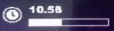

# Real-time clock for SteelSeries keyboards

Some SteelSeries keyboard models have an OLED screen for displaying small images, keyboard configurations or events from compatible games and apps. The aim of this project is to enable viewing of real time clock digits on the SteelSeries keyboard screen.

## Work in progress
The project was started on October 9th 2022 by taking a look at [SteelSeries GameSense SDK](https://github.com/SteelSeries/gamesense-sdk). Programming continued with small steps on October 14th and 15th, progressing to the first contribution on the 16th.

The minimum functionality target, the local time on the OLED screen, was achieved on October 30th 2022. Further development may include e.g. stability improvement, sleep mode/screen saver, start/stop schedule, using of illumination/RGB lighting...

## Working functionality
On the OLED screen is displayed [the icon for clock](https://github.com/SteelSeries/gamesense-sdk/blob/master/doc/api/event-icons.md), current time (e.g. 9.37 or 22.02) and a progress bar that depicts the running seconds and resets when the next minute begins.

## Requirements
- Node.js version 18
- SteelSeries Engine 3 or SteelSeries GG on Windows
- A screened SteelSeries device

## Instructions
- First time installation with npm package manager: "npm install".
- Starting the app on the command line: "node main.js".

More readme content coming later.
